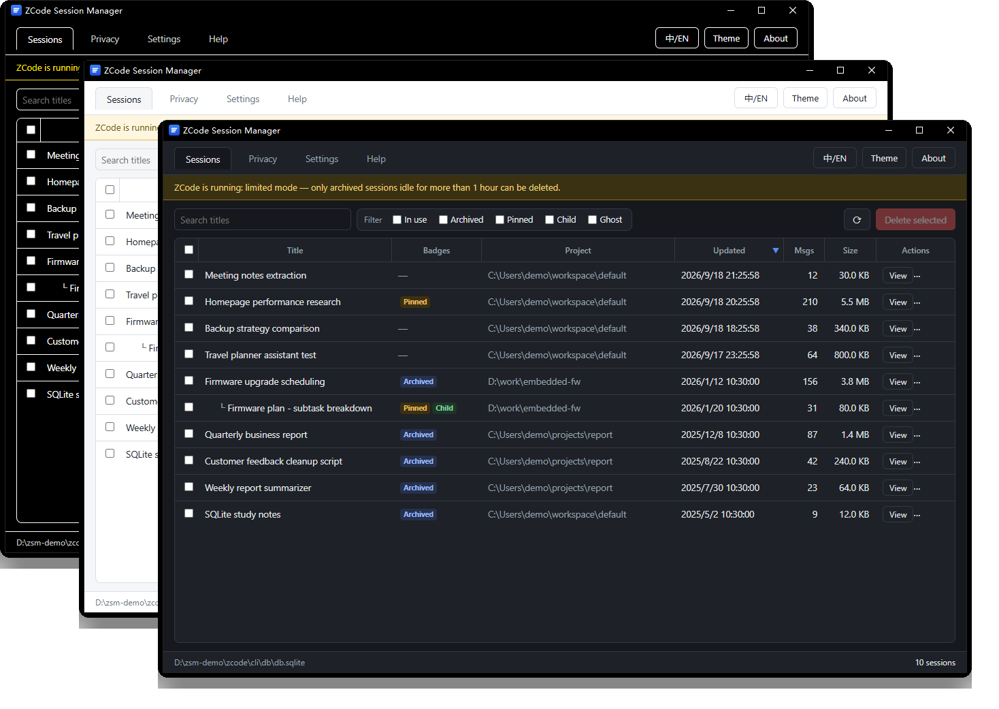
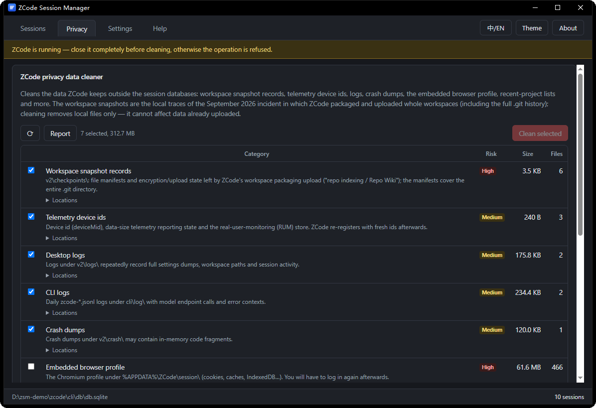

<div align="center">

# ZCode Session Manager

[简体中文](README.md) | English

**Put ZCode session control back where it belongs: in your hands.**

</div>

ZCode only offers "archiving" today: old sessions disappear from the list but remain in the
database and on disk — invisible and undeletable. **ZCode Session Manager provides the missing
half**: browse all historical sessions (including archived ones) and **truly delete** the ones
you choose from the ZCode database and disk. Every deletion is backed up first, verified
afterwards, and automatically restored if anything looks wrong.

In September 2026 ZCode was reported to package and upload whole workspaces (including the
full `.git` history) to the cloud. V1.4.0 adds a second tab, **Privacy**: inventories and
cleans that non-session data, and produces a **privacy report** (which workspaces / files
were uploaded, when, how large, server-accepted or not — exportable as CSV evidence).

<div align="center">
  
</div>

<div align="center">
  
</div>

## Features

- **Full scan**: auto-locates the ZCode data directory (overridable), lists every session with
  title, project, message count, disk usage and status
- **Status at a glance**: archived / pinned / child / ghost shown as colored chips; child sessions
  are indented under their parent in a tree
- **Combinable filters & sorting**: multi-select category filters, click any column header to sort
- **Session detail**: read-only message stream — prompts, replies, thinking, tool calls and outputs
- **True deletion**: single or bulk delete with automatic cascade across the content database,
  raw model I/O records and on-disk artifacts
- **Privacy cleaner**: a separate tab inventories what ZCode keeps outside the session
  databases — workspace snapshots (upload traces), telemetry device ids, desktop / CLI logs,
  crash dumps, the embedded browser profile, recent projects, the updater cache and agent
  memories — cleaned per selected category
- **Privacy report**: read-only table of which workspaces / files were packaged for upload,
  with times, encrypted sizes, server-acceptance and failed retries; exportable as CSV
- **Switch hardening**: one click force-disables ZCode's upload-related toggles
  (improvement program / repo snapshot indexing / instant Grep indexing)
- **Bilingual / three themes**: English & Chinese UI, light / dark / high-contrast themes, window
  title follows the language

## Download & install

Grab the portable single file from
[Releases](https://github.com/woooooooooolf/zcode-session-manager/releases/latest)
(named `zsm-windows-x64-V<version>.exe`, ~11 MB) and run it.
Requires the system WebView2 runtime (preinstalled on Windows 10/11). The binary is unsigned —
if SmartScreen warns on first launch, choose "Run anyway".

> [!IMPORTANT]
> **Disclaimer**: this tool works alongside ZCode and relies on the session storage format of
> the current ZCode version. A future ZCode update may change that format (the tool detects the
> difference and refuses to operate). **Before real use, create a throwaway session and delete it
> with this tool to confirm everything matches.**

## Safety & transparency

Deletion is serious. Four safeguards keep it **controlled and reversible**:

1. **Backup first** — affected databases and session files are simple-copied to the backup
   directory (default `zsm-backups\<timestamp>\`, configurable in Settings) before anything is touched
2. **Verify after** — both databases get an automatic integrity check; on failure everything is
   **restored from that backup** and clearly reported
3. **Limited mode** — while ZCode is running, only archived sessions idle beyond a threshold
   (default 1 hour, configurable) can be deleted; threshold and probe interval are adjustable
4. **Compatibility check** — if the database layout differs from what the tool expects, all
   operations are refused with a warning instead of being executed blindly

Deletion scope (transparency): content database rows, raw model I/O records (rollout), execution
caches (exec / artifacts / image-cache / agents) and desktop index rows; shared data such as
`v2\checkpoints\` and `memories\` is never touched by session deletion (the Privacy tab handles
those separately).

## Privacy cleaner

On 2026-09-18 ZCode's "repo indexing / Repo Wiki" feature was reported to package and upload
whole workspaces (including the full `.git` history) to the cloud after encrypting them
(Zhipu apologized and claims it is fixed). The second tab, **Privacy**, targets exactly that
kind of **non-session** data, fully independent of the Sessions tab:

- **Inventory**: nine categories with size, file count and locations; a directory that does not
  pass the ZCode structural check is never offered for cleaning
- **Privacy report**: read-only (works while ZCode runs) — which workspaces / files were
  packaged, when, encrypted sizes, server-acceptance, failed retries; CSV export for evidence —
  report first, clean afterwards
- **Cleaning**: per-category selection with two-step confirmation; directory targets keep the
  folder shell; refused while ZCode runs; no backup is created (targets are caches / logs /
  snapshot records, not user content); cleaning the browser profile logs you out and cleaning
  agent memories deletes ZCode's long-term memory about you (both unchecked by default)
- **Boundaries**: never reads or writes `db.sqlite` / `tasks-index.sqlite` or rollout / exec
  session data; category ids are whitelist-filtered; local cleaning cannot affect data already
  uploaded to servers

## Development

```powershell
cargo test -p zsm-core                # core unit tests (throwaway fake databases)
cargo tauri dev                       # run in development
cargo build --release -p zsm-gui      # build the portable single file
cargo tauri build                     # build the NSIS installer
```

Pushing a `V*` tag makes GitHub Actions test, build and publish the Release automatically.

## License

[MIT](LICENSE)
