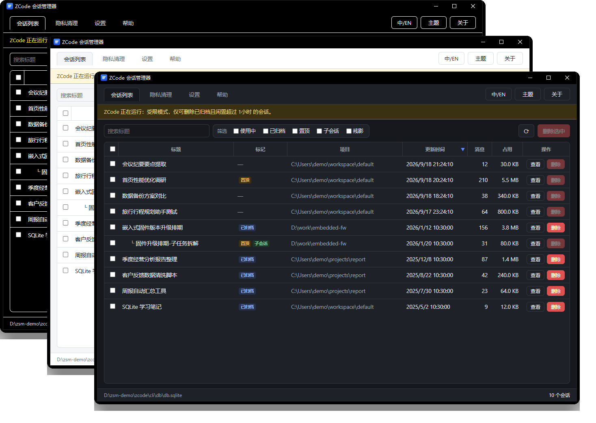
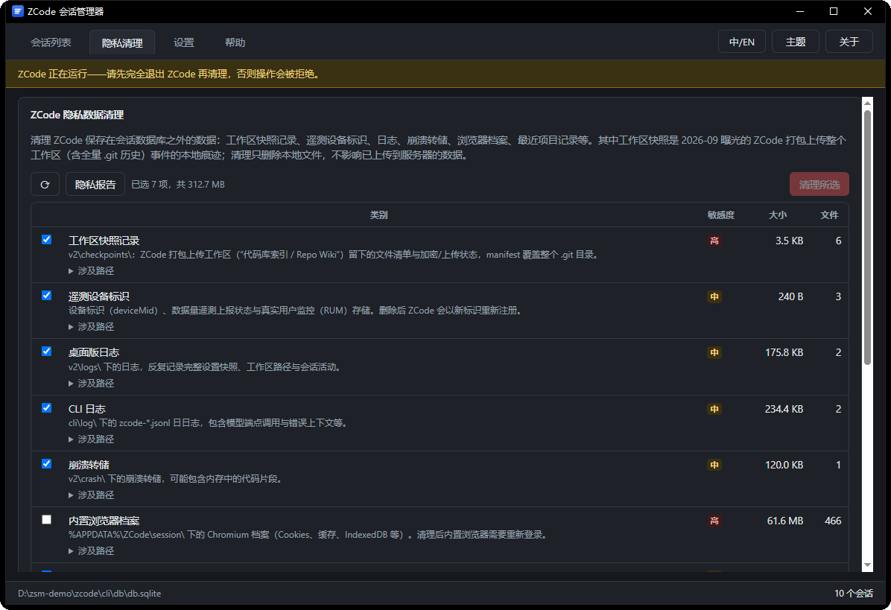

<div align="center">

# ZCode 会话管理器

简体中文 | [English](README.en.md)

**把 ZCode 会话的最终控制权，交还给用户。**

</div>

ZCode 目前只提供"归档"：历史会话从列表里消失，却仍然留存在数据库和磁盘中——看不见，也删不掉。
**ZCode 会话管理器补上缺失的另一半**：浏览全部历史会话（含已归档），并把选定的会话从
ZCode 数据库与磁盘中**彻底删除**。删除前自动备份，删除后自动校验，出问题可整体恢复。

2026-09 ZCode 被曝光曾把用户整个工作区（含全量 `.git` 历史）打包上传云端。V1.4.0 起内置
第二个选项卡**「隐私清理」**：盘点并清理这类会话数据库之外的隐私数据，并可生成
**隐私报告**（哪些工作区 / 文件被上传过、时间、大小、服务器接受状态，可导出 CSV 留证）。

<div align="center">
  
</div>

<div align="center">
  
</div>

## 功能

- **全量扫描**：自动定位 ZCode 数据目录（可手动指定），列出全部会话的标题、项目、消息数、磁盘占用与状态
- **状态一目了然**：已归档 / 置顶 / 子会话 / 残影以彩色标签直接标注；子会话树形缩进在父会话之下
- **组合筛选与排序**：按类别多选组合过滤，点击列头即可正序 / 逆序排列
- **会话详情**：只读浏览完整消息流——提问、回答、思考过程、工具调用及其输出
- **彻底删除**：单删或多选批量删除，自动级联清理数据库正文、原始对话记录与磁盘关联文件
- **隐私清理**：独立选项卡盘点 ZCode 在会话数据库之外保存的数据——工作区快照（上传痕迹）、遥测设备标识、桌面 / CLI 日志、崩溃转储、内置浏览器档案、最近项目记录、更新缓存与智能体记忆，按类别勾选清理
- **隐私报告**：只读表格列出哪些工作区 / 文件被打包上传及时间、加密包大小、服务器接受状态、失败重试次数，支持导出 CSV 留证
- **开关加固**：一键强制关闭 ZCode 的"优化计划 / 代码库快照索引"等上传相关开关
- **中英双语 / 三主题**：浅色、深色、高对比度；界面语言与窗口标题一键切换

## 下载与安装

从 [Releases](https://github.com/woooooooooolf/zcode-session-manager/releases/latest) 下载免安装单文件
（命名 `zsm-windows-x64-V<版本>.exe`，约 11 MB），双击即用。
需要系统自带的 WebView2 运行时（Windows 10/11 通常已内置）；未做代码签名，首次运行如遇
SmartScreen 提示，选择"仍要运行"即可。

> [!IMPORTANT]
> **使用声明**：本工具需与 ZCode 配合使用，按当前版本的会话存储格式工作。ZCode
> 官方未来调整会话保存格式的可能性无法排除（届时工具会检测到差异并拒绝操作）。
> **正式使用前，请先创建一个无意义的测试会话并对其执行删除，确认功能匹配后再处理真实数据。**

## 安全与透明

删除是严肃的操作。本工具用四道防线保证它**可控、可逆**：

1. **先备份** —— 删除前将涉及的数据库与全部会话文件简单拷贝到备份目录（默认 `zsm-backups\<时间戳>\`，可在设置中修改），随时可手工还原
2. **后校验** —— 删除完成后自动对数据库执行完整性检查，异常时**自动从本次备份整体恢复**并明确提示
3. **受限模式** —— 检测到 ZCode 正在运行时，仅允许删除已归档且闲置超过阈值（默认 1 小时，可设置）的会话，避免与 ZCode 自身的写入冲突；阈值与进程探测频率均可在设置中调整
4. **格式兼容检查** —— 数据库结构与本工具预期不符时，拒绝一切操作并提示，而不是盲目执行

删除范围（透明起见）：会话正文数据库行、原始模型输入输出记录（rollout）、执行缓存
（exec / artifacts / image-cache / agents）与桌面索引行；`v2\checkpoints\`、`memories\`
等共享数据不受会话删除影响（由「隐私清理」选项卡单独处理）。

## 隐私清理

2026-09-18，ZCode 被曝光其"代码库索引 / Repo Wiki"功能会把用户整个工作区（含全量
`.git` 历史）打包加密后上传云端（官方已致歉并称修复）。本工具的第二个选项卡「隐私清理」
针对这类**会话数据库之外**的数据，与「会话列表」互不影响：

- **盘点**：九类数据的大小、文件数与涉及路径一目了然；ZCode 结构校验不通过的数据目录不纳入清理范围
- **隐私报告**：只读（ZCode 运行中可用），列出哪些工作区 / 文件被打包上传、时间、加密包大小、服务器是否接受、失败重试次数，支持导出 CSV 留证——建议先报告留证、再执行清理
- **清理**：按类别勾选、两步确认；目录类只清内容保留目录本身；ZCode 运行中一律拒绝执行；清理对象是缓存 / 日志 / 快照记录而非用户内容，不创建备份；清理「内置浏览器档案」会登出嵌入式浏览器、「智能体记忆」会删除 ZCode 对你的长期记忆（两者默认不勾选）
- **边界**：完全不读写 `db.sqlite` / `tasks-index.sqlite` 与 rollout / exec 等会话数据；清理类别按白名单过滤；本地清理不影响已上传到服务器的数据

## 开发

```powershell
cargo test -p zsm-core                # 核心逻辑单元测试（临时伪库，不碰真实数据）
cargo tauri dev                       # 开发运行
cargo build --release -p zsm-gui      # 构建免安装单文件
cargo tauri build                     # 构建 NSIS 安装包
```

推送 `V*` 标签时，GitHub Actions 会自动完成测试、构建与 Release 发布。

## 许可证

[MIT](LICENSE)
